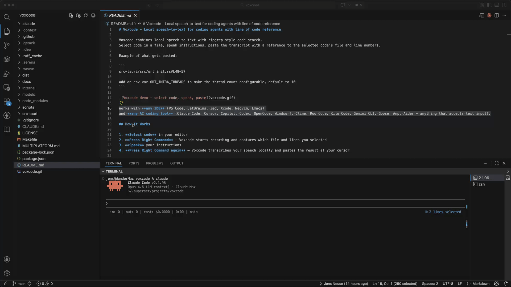

# Voxcode - Local speech-to-text for coding agents with line of code reference

Voxcode combines local speech-to-text with ripgrep-style code search.
Select code in a file, speak instructions, paste the transcript with a reference to the selected code's file and line numbers.

Example of what gets pasted:

```
src-tauri/src/ort_init.rs#L49-57

Add an env var ORT_INTRA_THREADS to make the thread count configurable, default to 10
```

&nbsp;

&nbsp;

> [!TIP]
> Works with **any IDE** (VS Code, JetBrains, Zed, Xcode, Neovim, Emacs)
> and **any AI coding tool** (Claude Code, Cursor, Copilot, Codex, OpenCode, Windsurf, Cline, Roo Code, Kilo Code, Gemini CLI, Goose, Amp, Aider — anything that accepts text input).

&nbsp;

&nbsp;



## How It Works

1. **Select code** in your editor
2. **Press Right Command** — Voxcode starts recording and captures which file and lines you selected
3. **Speak** your instructions
4. **Press Right Command again** — Voxcode transcribes your speech locally and pastes the result at your cursor

What gets pasted is your spoken instruction with the code context attached,
so the AI agent knows exactly what code you're referring to:

```
src-tauri/src/ort_init.rs#L49-57

Add an env var ORT_INTRA_THREADS to make the thread count configurable, default to 10
```

If the selected code can't be pinpointed to exact lines,
Voxcode falls back to pasting the selected text with the transcript:

```
```rust
let thread_pool = ort::environment::GlobalThreadPoolOptions::default()
    .with_intra_threads(intra_threads)
    .map_err(|e| format!("Failed to configure thread pool: {e}"))?;
```​

Refactor this to read the thread count from a config file instead of an env var
```

## Why I Built This

My name is Jens, I'm the CEO of [WunderGraph](https://wundergraph.com/?utm_source=voxcode).
At our company, you can't vibe code.
Like many others, we're heavy users of agentic coding tools,
but we carefully review generated code and interact a lot with the agents.

Our company provides GraphQL Federation infrastructure for companies like eBay, SoundCloud, Paramount and others.
Federation is a powerful architectural pattern that lets you compose multiple APIs into a single unified graph,
solving two common problems I see companies hit constantly:

1. **API/BFF sprawl** - many backends by different teams, many apps, BFFs in the middle, and no clear ownership or visibility. Things break on every change and coding agents make it worse.
2. **Agentic API integration** - AI agents that waste minutes and hundreds of thousands of tokens exploring internal API landscapes

Federation solves both by letting teams contribute to a unified Supergraph.
Before publishing an API change, you can always validate if you're about to break an existing contract.
Agents can generate queries against the Supergraph in seconds, with up to 99% fewer tokens,
independently of the scale of the underlying architecture.

If the problems resonate with you, check out [WunderGraph](https://wundergraph.com/?utm_source=voxcode).

Although we're 30+ people, I'm still involved in product and engineering,
working across a distributed codebase, many repos, many IDEs.
I use GoLand for Go, VS Code for prose,
and [Superset](https://superset.sh/) for agentic coding workspaces.

My biggest bottleneck when working with coding agents like Claude Code or Codex was always the friction of telling the agent exactly where in the codebase I want it to make changes.
If I want to have a function refactored or the structure of a test changed, I can manually tell the model about the file and the line numbers, or maybe tell a file name and a function name, or simply copy-paste the relevant code snippet.
In case of the latter, I'm wasting tokens and the model has to search for the relevant code in the file anyway,
even though I already know exactly where it is and what it's called.
Some tools like Claude have plugins that can understand what file you have open and which lines you have selected,
but that only works in some IDEs and you can't queue up multiple instructions with this approach.

I found [superwhisper](https://superwhisper.com/) which worked great for speech-to-text,
but it didn't solve the code selection problem and I had to pay for a subscription when the tool actually runs locally with an open-source model.

So I built Voxcode.
It's deliberately dumb. It assumes nothing about your coding environment or your AI tool.
All it does is voice-to-text and ripgrep-style file search.
It works, it's fast, and it helps me move faster when working with coding agents.

If you're using a similar workflow you might find it useful too.

## How It Works Under the Hood

Voxcode doesn't integrate with any IDE or coding tool directly.
It operates on files — reading what you selected,
finding where it lives on disk,
and pasting the result wherever your cursor is.

### Repo indexing

On startup, Voxcode scans your home directory (depth 5) for git repositories on a background thread.
Each repo's file count is recorded (respecting `.gitignore`),
and the index is sorted lightest-first.
A filesystem watcher (`notify` crate) picks up new repos automatically.

### Text capture

When you press the hotkey,
macOS Accessibility APIs read the selected text and line numbers from the active editor window.
If the Accessibility API doesn't return selected text (some apps don't support it),
Voxcode falls back to simulating Cmd+C.

### File search - How we made it fast

The naive approach would be to spawn [ripgrep](https://github.com/BurntSushi/ripgrep) once per repo.
With 200 repos, that means 200 process spawns at ~25ms each.
Even with 16 parallel workers, a cold search took ~9 seconds.

The solution: eliminate process spawns entirely.
All repo roots are fed into a single parallel file walker
([`ignore`](https://crates.io/crates/ignore) crate, from the ripgrep ecosystem).
It walks files across all repos simultaneously,
respecting every `.gitignore`.
Each file is checked with [`memchr::memmem`](https://crates.io/crates/memchr) —
the same SIMD-accelerated string matching algorithm ripgrep uses internally.
On first match, all walker threads exit immediately.

Result: the same search across 200 repos dropped from **9 seconds to under 1 second** (10x).
Repos that produce hits are promoted to the front of the index,
so repeat searches in the same project are near-instant (<10ms)

### Probe strategy

Up to 3 non-trivial lines are picked from the selected text (first, middle, last).
A file must contain ALL probe lines to count as a match.
This eliminates false positives from common code patterns like imports or braces.

### Transcription

The [Parakeet TDT](https://huggingface.co/nvidia/parakeet-tdt-0.6b-v2) model runs via ONNX Runtime,
fully local — no audio leaves your machine.
Transcription runs on a background thread while you're still speaking.

### Paste

The resolved `file#Lstart-end` reference + your transcript are written to the clipboard,
Voxcode switches back to the previous app, and pastes.

## Prerequisites

- macOS 13.0+
- [Rust](https://rustup.rs/) (stable)
- [Node.js](https://nodejs.org/) (for the Tauri CLI)
- [ONNX Runtime](https://onnxruntime.ai/) — install via Homebrew: `brew install onnxruntime`
- Accessibility permission (System Settings > Privacy & Security > Accessibility)
- Microphone permission

## Setup

1. **Clone the repository**

   ```sh
   git clone https://github.com/jensneuse/voxcode.git
   cd voxcode
   ```

2. **Install dependencies and download models**

   ```sh
   make
   ```

   This installs Node dependencies (Tauri CLI),
   copies the ONNX Runtime dylib from your Homebrew installation,
   and downloads the Parakeet TDT speech-to-text model from HuggingFace.
   Subsequent runs are no-ops if everything is already in place.

3. **Run in development mode**

   ```sh
   make dev
   ```

   On first run, macOS will prompt for Accessibility and Microphone permissions.

## Make Commands

| Command | Description |
|---|---|
| `make` | Install all dependencies and download models |
| `make dev` | Run the app in development mode with hot reload |
| `make build` | Build a release `.app` bundle and `.dmg` |
| `make run` | Build for release and open the app |

## Environment Variables

| Variable | Description |
|---|---|
| `ORT_DYLIB_PATH` | Override the ONNX Runtime dylib location. By default, the app looks in `src-tauri/resources/libonnxruntime.dylib`. |
| `ORT_INTRA_THREADS` | Number of intra-op threads for ONNX Runtime inference. Defaults to `10`, which is ~9% faster than the default (16) on Apple Silicon. |
| `SKIP_REAL_ORT_INIT` | Set to any value to skip ONNX Runtime initialization. Useful for running tests that don't need the inference engine. |
| `RUST_LOG` | Controls log verbosity. Defaults to `info`. Example: `RUST_LOG=debug make dev` |

## Project Structure

```
dist/                         Frontend (HTML/CSS/JS) served by Tauri
src-tauri/
  src/
    lib.rs                    App entry point, tray menu, recording state machine
    main.rs                   Binary entry point
    audio.rs                  Audio capture via cpal, resampling
    config.rs                 User configuration
    editor_context.rs         Captures active editor file/selection for context
    error.rs                  Error types
    hotkey.rs                 Global hotkey listener (CGEventTap)
    ort_init.rs               ONNX Runtime initialization
    parakeet.rs               Parakeet TDT model loading and transcription
    parakeet_longform.rs      Long-form audio transcription support
    paste.rs                  Clipboard paste
    repo_index.rs             Git repository indexer and parallel file search
    state.rs                  Recording state machine
    window_ext.rs             macOS window management helpers
  tests/                      Integration tests
  benches/                    Performance benchmarks
  resources/                  Models and dylibs (gitignored, created by setup script)
scripts/
  download-models.sh          Downloads models and ONNX Runtime dylib
```

## Multi-Platform

Voxcode is macOS-only.
See [MULTIPLATFORM.md](MULTIPLATFORM.md) for a porting guide if you'd like to contribute Windows or Linux support.

## License

[MIT](LICENSE)

---

Built by [Jens Neuse](https://github.com/jensneuse) at [WunderGraph](https://wundergraph.com/?utm_source=voxcode)
